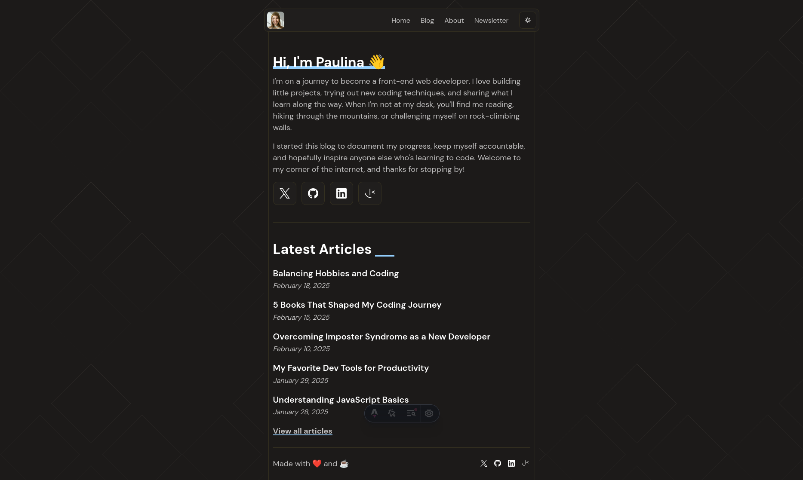

# Frontend Mentor - Personal blog solution

This is a solution to the [Personal blog challenge on Frontend Mentor](https://www.frontendmentor.io/challenges/personal-blog-lJpVCnmozL). Frontend Mentor challenges help you improve your coding skills by building realistic projects. 

## Table of contents

- [Overview](#overview)
  - [The challenge](#the-challenge)
  - [Screenshot](#screenshot)
  - [Links](#links)
- [My process](#my-process)
  - [Built with](#built-with)
  - [What I learned](#what-i-learned)
  - [Continued development](#continued-development)
  - [Useful resources](#useful-resources)
- [Author](#author)
- [Acknowledgments](#acknowledgments)

## Overview

### The challenge

Users should be able to:

- Navigate to all pages by clicking links or using their keyboard
- Read all articles
- Select their color theme
- Submit their email to subscribe to the newsletter
- Receive an error message when the newsletter form is submitted if:
  - The Email Address field is empty
  - The Email Address is not formatted correctly
- Receive a success message if submitted correctly
- View the optimal layout for the interface depending on their device's screen size
- See hover and focus states for all interactive elements on the page

### Screenshot

### Links

- Solution URL: [https://github.com/zepolrepus/personal-blog](https://github.com/zepolrepus/personal-blog)
- Live Site URL: [Add live site URL here](https://your-live-site-url.com)

## My process

### Built with

- [Astro](https://reactjs.org/) - JS library
- [Tailwind](https://nextjs.org/) - React framework
- [Markdown]
- [Rehype-Callouts](https://github.com/lin-stephanie/rehype-callouts)

### What I learned

A very interesting challenge where I learned how to create a blog based on markdown files

## Author

- Frontend Mentor - [@zepolrepus](https://www.frontendmentor.io/profile/zepolrepus)
